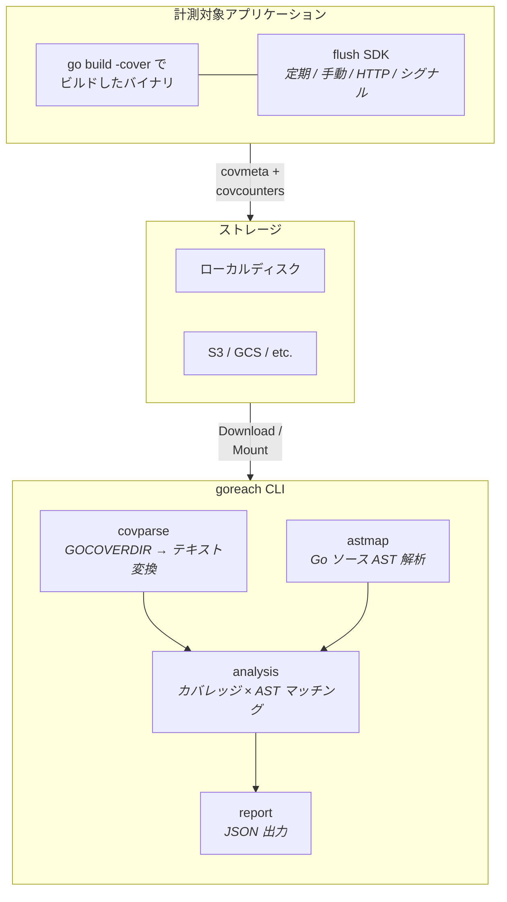
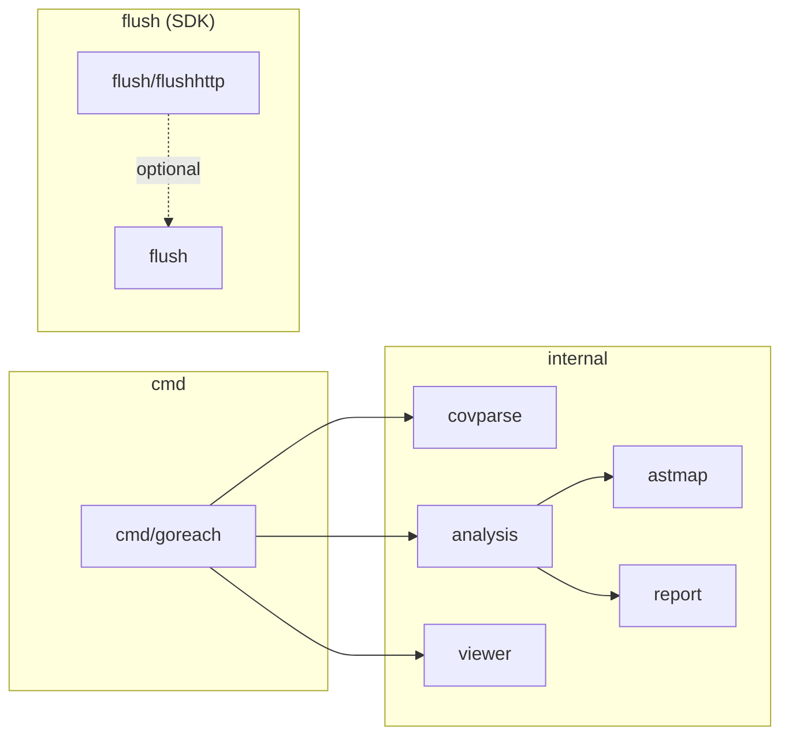

# goreach

**稼働中の Go サービスで、実際に通っていないコードパスを特定する。**

Go のネイティブカバレッジ機能（`go build -cover` / `GOCOVERDIR`）の上に薄いレイヤーを載せ、未到達コードを JSON で可視化する。

## アーキテクチャ



### パッケージ構成



| パッケージ | 役割 | 外部依存 |
|-----------|------|---------|
| `cmd/goreach` | CLI エントリポイント（`analyze` / `summary` / `view`） | — |
| `internal/covparse` | GOCOVERDIR バイナリ → テキスト変換 | — |
| `internal/astmap` | Go ソースを AST 解析し関数境界を抽出 | — |
| `internal/analysis` | カバレッジブロックと関数を突き合わせ | `golang.org/x/tools` |
| `internal/report` | JSON レポート構造体と出力 | — |
| `internal/viewer` | Web UI サーバー（`view` コマンド） | — |
| `flush` | 計測対象アプリに組み込む SDK | — |
| `flush/flushhttp` | HTTP 経由のカバレッジ制御（opt-in） | `net/http` |
| `flush/objstore` | リモートストレージへのカバレッジ保存 | — |

## インストール

```bash
go install github.com/yag13s/goreach/cmd/goreach@latest
```

## クイックスタート

```bash
# 1. カバレッジ付きビルド
go build -cover -covermode=set -o myserver ./cmd/myserver

# 2. GOCOVERDIR を指定して実行
mkdir -p /tmp/coverage
GOCOVERDIR=/tmp/coverage ./myserver

# 3. プロセス停止（カバレッジ自動書き出し）
kill -TERM $(pgrep myserver)

# 4. 分析
goreach analyze -coverdir /tmp/coverage -pretty
```

## CLI リファレンス

### `goreach analyze`

GOCOVERDIR またはテキストプロファイルから未到達コードを分析し、JSON レポートを出力する。

```bash
# GOCOVERDIR から分析（再帰探索）
goreach analyze -coverdir /var/coverage -r -pretty

# テキストプロファイルから分析
goreach analyze -profile coverage.txt -pretty

# 特定パッケージのみ、完全未到達関数だけ表示
goreach analyze -coverdir /var/coverage -r -pkg "myapp/internal" -threshold 0

# ファイルに出力
goreach analyze -coverdir /var/coverage -r -o report.json
```

| フラグ | 説明 | デフォルト |
|--------|------|-----------|
| `-profile <file>` | テキスト形式カバレッジプロファイルのパス | — |
| `-coverdir <dir>` | GOCOVERDIR パス（`-profile` と排他） | — |
| `-r` | `-coverdir` 配下を再帰探索 | `false` |
| `-pkg <prefixes>` | パッケージフィルタ（カンマ区切り） | 全パッケージ |
| `-threshold <float>` | カバレッジがこの % 以下の関数のみ表示 | `100`（全関数） |
| `-min-statements <n>` | 未到達ステートメントが N 以上の関数のみ | `0` |
| `-o <file>` | 出力ファイル | stdout |
| `-pretty` | JSON を整形出力 | `false` |

### `goreach view`

レポート JSON をブラウザで表示する Web UI サーバーを起動する。

```bash
# 基本
goreach view report.json

# ソースコードプレビュー付き（unreached block をクリックで展開）
goreach view -src ./myproject report.json

# ポート指定・ブラウザ自動オープン無効化
goreach view -port 8888 -no-open report.json
```

| フラグ | 説明 | デフォルト |
|--------|------|-----------|
| `-src <dir>` | ソースルートディレクトリ（コードプレビュー有効化） | —（無効） |
| `-port <n>` | HTTP ポート | `0`（ランダム） |
| `-no-open` | ブラウザの自動オープンを無効化 | `false` |

`-src` を指定すると、Web UI 上の unreached block をクリックしてソースコードをインライン展開できる。隣接するブロックは自動的にマージされて一続きで表示される。`-src` 未指定時は従来通り行番号のみの表示。

### `goreach summary`

カバレッジサマリをテキストで表示する。

```bash
goreach summary -coverdir /var/coverage -r
goreach summary -profile coverage.txt
```

### JSON 出力例

```json
{
  "version": 1,
  "generated_at": "2026-02-27T10:30:00Z",
  "mode": "set",
  "total": {
    "total_statements": 1250,
    "covered_statements": 890,
    "coverage_percent": 71.2
  },
  "packages": [
    {
      "import_path": "myapp/internal/auth",
      "total": { "total_statements": 200, "covered_statements": 145, "coverage_percent": 72.5 },
      "files": [
        {
          "file_name": "myapp/internal/auth/oauth.go",
          "total": { "total_statements": 120, "covered_statements": 85, "coverage_percent": 70.8 },
          "functions": [
            {
              "name": "(*OAuthHandler).RefreshToken",
              "line": 112,
              "total_statements": 25,
              "covered_statements": 0,
              "coverage_percent": 0.0,
              "unreached_blocks": [
                { "start_line": 113, "start_col": 2, "end_line": 135, "end_col": 3, "num_statements": 25 }
              ]
            }
          ]
        }
      ]
    }
  ]
}
```

## flush SDK

プロセス終了を待たずにカバレッジデータをフラッシュするためのライブラリ。常駐サーバー、Lambda、バッチ処理に対応。

```go
import "github.com/yag13s/goreach/flush"
```

### 基本的な使い方

```go
flush.Enable(flush.Config{
    Storage:      flush.LocalStorage{Dir: "/var/coverage/myserver"},
    ServiceName:  "myserver",
    BuildVersion: version, // ldflags で埋め込んだコミットハッシュ等
    Interval:     5 * time.Minute,
    Clear:        true,
})
defer flush.Stop()
```

`-cover` なしでビルドされたバイナリでも `flush` はパニックしない（no-op になる）。

> **重要:** flush SDK を使う場合は `-covermode=atomic` でビルドすること。`runtime/coverage.WriteCountersDir` は実行中のプロセスからカウンタを安全に読み取るため atomic モードを要求する。`-covermode=set` でビルドするとフラッシュ時にエラーになる。

### Storage インターフェース

保存先はインターフェースで抽象化されている。ビルトイン実装のほか、独自実装を注入可能。

```go
type Storage interface {
    Store(ctx context.Context, files []string, meta Metadata) error
}
```

**ビルトイン実装:**

| 実装 | 用途 |
|------|------|
| `flush.LocalStorage{Dir: "..."}` | ローカルディスク保存（GOCOVERDIR 互換） |
| `flush.WriterStorage{W: os.Stdout}` | `io.Writer` に書き出し（デバッグ用） |
| `objstore.Storage{...}` | リモートオブジェクトストレージへアップロード |

**リモート保存（`flush/objstore` パッケージ）:**

```go
import (
    // ...
    "github.com/yag13s/goreach/flush/objstore"
    "github.com/aws/aws-sdk-go-v2/config"
    "github.com/aws/aws-sdk-go-v2/service/s3"
)

cfg, _ := config.LoadDefaultConfig(ctx)
client := s3.NewFromConfig(cfg)
bucket := "coverage-data"

storage := &objstore.Storage{
    Upload: func(ctx context.Context, key string, body io.Reader) error {
        _, err := client.PutObject(ctx, &s3.PutObjectInput{
            Bucket: &bucket, Key: &key, Body: body,
        })
        return err
    },
    // Prefix: "goreach"  （デフォルト）
    // KeyFunc: nil        （デフォルト: <prefix>/<service>/<version>/<pod>/<file>）
}
```

`Uploader` は `func(ctx, key, body) error` なので、S3 以外（GCS, Azure Blob 等）にもそのまま使えるはず

### フラッシュのトリガー方式

| 方式 | ユースケース | コード |
|------|-------------|--------|
| 定期実行 | 常時稼働サーバー | `Config{Interval: 5 * time.Minute}` |
| 手動呼び出し | Lambda 等リクエスト単位 | `flush.Emit()` |
| HTTP エンドポイント | k8s CronJob トリガー | `mux.Handle("/internal/coverage/", flushhttp.Handler())` |
| シグナル | バッチ処理、非 HTTP プロセス | `flush.HandleSignal(syscall.SIGUSR1)` |
| プロセス終了時 | 全プロセス共通 | `defer flush.Stop()` |

### HTTP エンドポイント（opt-in）

HTTP 経由でのカバレッジ制御が必要な場合のみインポートする。`flush` パッケージ本体は `net/http` に依存しない。

```go
import "github.com/yag13s/goreach/flush/flushhttp"

mux.Handle("/internal/coverage/", flushhttp.Handler())
```

| メソッド | パス | 動作 |
|---------|------|------|
| `GET` | `/internal/coverage` | カバレッジデータを返す |
| `POST` | `/internal/coverage/flush` | Storage にフラッシュ |
| `POST` | `/internal/coverage/clear` | カウンタリセット |

## ワークフロー例

### ローカル開発

```bash
go build -cover -covermode=set -o myserver ./cmd/myserver
mkdir -p /tmp/coverage
GOCOVERDIR=/tmp/coverage ./myserver
# テスト実行後にプロセス停止
kill -TERM $(pgrep myserver)
goreach analyze -coverdir /tmp/coverage -pretty -o report.json

# ブラウザで確認
goreach view -src . report.json
```

### k8s 本番環境（push 型 — S3 保存）

flush SDK を使うため `-covermode=atomic` でビルドすること。

```go
import (
    // ...
    "github.com/yag13s/goreach/flush"
    "github.com/yag13s/goreach/flush/objstore"
    "github.com/aws/aws-sdk-go-v2/config"
    "github.com/aws/aws-sdk-go-v2/service/s3"
)

func main() {
    cfg, _ := config.LoadDefaultConfig(context.Background())
    client := s3.NewFromConfig(cfg)
    bucket := "coverage-data"

    flush.Enable(flush.Config{
        Storage: &objstore.Storage{
            Upload: func(ctx context.Context, key string, body io.Reader) error {
                _, err := client.PutObject(ctx, &s3.PutObjectInput{
                    Bucket: &bucket, Key: &key, Body: body,
                })
                return err
            },
        },
        ServiceName:  "myserver",
        BuildVersion: version,
        Interval:     10 * time.Minute,
    })
    defer flush.Stop()
    // ... 既存のサーバーコード ...
}
```

```bash
aws s3 sync s3://coverage-data/goreach/myserver/abc123/ /tmp/coverage/
goreach analyze -coverdir /tmp/coverage -r -pretty
```

### k8s 本番環境（CronJob トリガー型）

```go
mux.Handle("/internal/coverage/", flushhttp.Handler())
```

```yaml
apiVersion: batch/v1
kind: CronJob
spec:
  schedule: "0 */6 * * *"
  jobTemplate:
    spec:
      containers:
      - name: coverage-trigger
        command: ["curl", "-X", "POST", "http://myserver:8080/internal/coverage/flush"]
```

### AWS Lambda

Lambda はリクエスト間で実行環境がフリーズするため、定期フラッシュ（`Interval`）は機能しない。リクエストごとに `flush.Emit()` を呼ぶなどする

```go
// init() or main()
flush.Enable(flush.Config{
    Storage:      storage, // objstore.Storage 等
    ServiceName:  "my-lambda",
    BuildVersion: os.Getenv("BUILD_VERSION"),
    Clear:        true,
})

// handler
func handler(ctx context.Context, req events.APIGatewayV2HTTPRequest) (events.APIGatewayV2HTTPResponse, error) {
    resp, err := process(ctx, req)
    flush.Emit()
    return resp, err
}
```

**注意点:**
- `-cover` ビルドではコンパイラがメタデータ書き出しを main パッケージの `init` に注入する。ユーザーの `init()` より先に走るため、`GOCOVERDIR` のディレクトリはプロセス起動前に存在している必要がある
- `defer flush.Stop()` は不要（`lambda.Start()` は return しない）
- リクエストごとに flush するためファイル数が多くなる。必要に応じて S3 上のファイルを定期的にマージすること

```bash
# ビルド例
GOOS=linux GOARCH=arm64 go build -cover -covermode=atomic -o bootstrap.bin .
printf '#!/bin/sh\nmkdir -p /tmp/coverage-data\nexec /var/task/bootstrap.bin "$@"\n' > bootstrap
chmod +x bootstrap
```

環境変数: `GOCOVERDIR=/tmp/coverage-data`

### バッチ処理

```bash
go build -cover -o mybatch ./cmd/mybatch
GOCOVERDIR=/tmp/coverage ./mybatch --input data.csv
goreach analyze -coverdir /tmp/coverage -pretty
```

## 設計方針

- `flush` パッケージは外部依存なし（`runtime/coverage` + stdlib のみ）
- HTTP ハンドラは `flush/flushhttp` に分離
- `flush/objstore` はリモート保存のボイラープレート（キー生成・ファイル読み出し）を提供
- covmeta / covcounters のバイナリファイルをそのまま保存（テキスト変換は分析時に実施）
- ビルドバージョンが変わると covmeta の互換性が壊れるため、バージョン単位でデータを分離
- `-cover` なしでビルドされたバイナリでも `flush` はパニックしない（no-op）

## 必要要件

- Go 1.26+
- `go tool covdata`

## License

[MIT](LICENSE)
