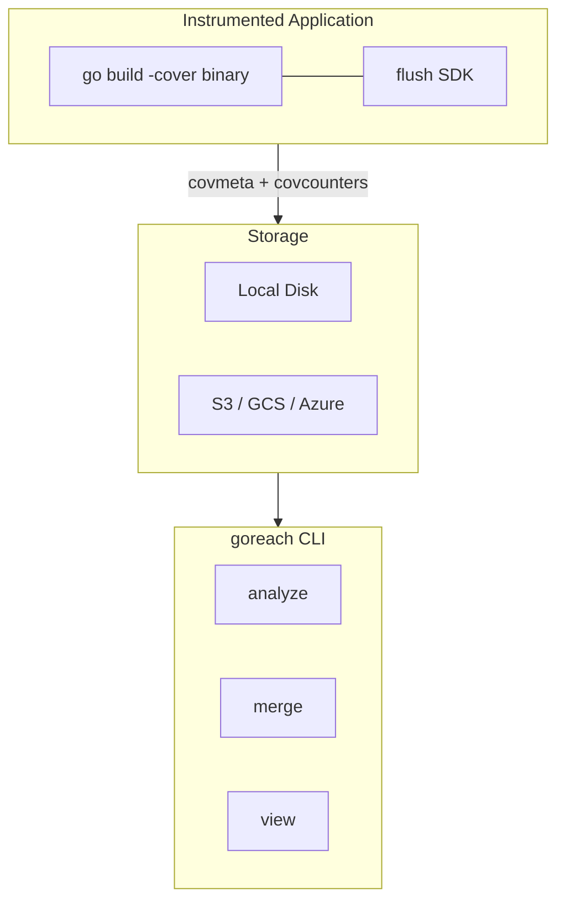

# goreach

[](https://pkg.go.dev/github.com/yag13s/goreach)
[](https://goreportcard.com/report/github.com/yag13s/goreach)
[](LICENSE)

**Find unreached code paths in running Go services.**

goreach sits on top of Go's native coverage instrumentation (`go build -cover` / `GOCOVERDIR`) and turns raw coverage data into actionable JSON reports highlighting exactly which functions and code blocks your production traffic never touches.

## Key Features

- **Production coverage analysis** -- Collect coverage from long-running services without stopping them
- **Flush SDK** -- Lightweight, zero-dependency library to emit coverage data on a schedule, via HTTP, signal, or manual trigger
- **Multi-build merge** -- Automatically reconcile coverage across different binary versions
- **Web UI** -- Interactive browser-based viewer with inline source preview
- **Cloud-agnostic storage** -- Local disk, S3, GCS, Azure, or any custom backend via a simple interface

## Install

```bash
go install github.com/yag13s/goreach/cmd/goreach@latest
```

## Quick Start

```bash
# Build with coverage
go build -cover -covermode=set -o myserver ./cmd/myserver

# Run with GOCOVERDIR
mkdir -p /tmp/coverage
GOCOVERDIR=/tmp/coverage ./myserver

# Stop the process, then analyze
goreach analyze -coverdir /tmp/coverage -pretty
```

<details>
<summary>View the report in browser</summary>

```bash
goreach view -src . report.json
```

</details>

## CLI Commands

| Command | Description |
|---------|-------------|
| `goreach analyze` | Analyze coverage data and output unreached code as JSON |
| `goreach merge` | Merge multiple reports, taking max coverage per function |
| `goreach view` | Launch interactive Web UI with optional source preview |
| `goreach summary` | Print a text coverage summary |
| `goreach version` | Show version info |

<details>
<summary><strong>analyze</strong> flags</summary>

| Flag | Description | Default |
|------|-------------|---------|
| `-profile <file>` | Text coverage profile path | -- |
| `-coverdir <dir>` | GOCOVERDIR path (exclusive with `-profile`) | -- |
| `-r` | Recursively search coverdir | `false` |
| `-pkg <prefixes>` | Package filter (comma-separated) | all |
| `-threshold <float>` | Show functions with coverage <= X% | `100` |
| `-min-statements <n>` | Show functions with >= N unreached statements | `0` |
| `-o <file>` | Output file | stdout |
| `-pretty` | Pretty-print JSON | `false` |

</details>

<details>
<summary><strong>merge</strong> flags</summary>

| Flag | Description | Default |
|------|-------------|---------|
| `-o <file>` | Output file | stdout |
| `-pretty` | Pretty-print JSON | `false` |

Uses the newest report as the structural base. Takes the maximum `coverage_percent` per function across all inputs. Deleted functions (only in older reports) are excluded.

When an older build wins on coverage but lacks unreached block detail (e.g. covdata func origin), the latest build's blocks are preserved in `latest_unreached_blocks`. The viewer shows a toggle to switch between merged and latest-build block views.

</details>

<details>
<summary><strong>view</strong> flags</summary>

| Flag | Description | Default |
|------|-------------|---------|
| `-src <dir>` | Source root for inline code preview | -- (disabled) |
| `-port <n>` | HTTP port | `0` (random) |
| `-no-open` | Don't auto-open browser | `false` |

</details>

## Flush SDK

A zero-dependency library for collecting coverage from running processes. Embed it in your service to flush coverage data without waiting for process exit.

```go
import "github.com/yag13s/goreach/flush"

flush.Enable(flush.Config{
    Storage:      flush.LocalStorage{Dir: "/var/coverage"},
    ServiceName:  "myserver",
    BuildVersion: version,
    Interval:     5 * time.Minute,
    Clear:        true,
})
defer flush.Stop()
```

> **Note:** When using the flush SDK, build with `-covermode=atomic`. The `set` mode is not supported for runtime counter reads.

Safe to call on binaries built without `-cover` -- all flush operations become no-ops.

### Flush Triggers

| Trigger | Use Case | How |
|---------|----------|-----|
| Periodic | Long-running servers | `Config{Interval: 5 * time.Minute}` |
| Manual | Lambda, request-scoped | `flush.Emit()` |
| HTTP | CronJob, external trigger | `flushhttp.Handler()` |
| Signal | Batch jobs, non-HTTP processes | `flush.HandleSignal(syscall.SIGUSR1)` |
| Shutdown | All processes | `defer flush.Stop()` |

### Storage Interface

```go
type Storage interface {
    Store(ctx context.Context, files []string, meta Metadata) error
}
```

Built-in: `LocalStorage`, `WriterStorage`, `objstore.Storage` (S3/GCS/Azure).

<details>
<summary>S3 example</summary>

```go
import "github.com/yag13s/goreach/flush/objstore"

storage := &objstore.Storage{
    Upload: func(ctx context.Context, key string, body io.Reader) error {
        _, err := s3Client.PutObject(ctx, &s3.PutObjectInput{
            Bucket: &bucket, Key: &key, Body: body,
        })
        return err
    },
}
```

Default key format: `<prefix>/<service>/<version>/<pod>/<filename>`

</details>

### HTTP Endpoints (opt-in)

```go
import "github.com/yag13s/goreach/flush/flushhttp"

mux.Handle("/internal/coverage/", flushhttp.Handler())
```

| Method | Path | Action |
|--------|------|--------|
| `GET` | `/internal/coverage` | Return current coverage data |
| `POST` | `/internal/coverage/flush` | Flush to storage |
| `POST` | `/internal/coverage/clear` | Reset counters |

## Architecture



## Deployment Examples

<details>
<summary><strong>Kubernetes + S3</strong></summary>

```go
flush.Enable(flush.Config{
    Storage: &objstore.Storage{
        Upload: func(ctx context.Context, key string, body io.Reader) error {
            _, err := s3Client.PutObject(ctx, &s3.PutObjectInput{
                Bucket: &bucket, Key: &key, Body: body,
            })
            return err
        },
    },
    ServiceName:  "myserver",
    BuildVersion: version,
    Interval:     10 * time.Minute,
})
defer flush.Stop()
```

```bash
# Download and analyze
aws s3 sync s3://bucket/goreach/myserver/ /tmp/coverage/
goreach analyze -coverdir /tmp/coverage -r -pretty
```

</details>

<details>
<summary><strong>AWS Lambda</strong></summary>

```go
// init
flush.Enable(flush.Config{
    Storage:      storage,
    ServiceName:  "my-lambda",
    BuildVersion: os.Getenv("BUILD_VERSION"),
    Clear:        true,
})

// handler -- flush per request
func handler(ctx context.Context, req events.APIGatewayV2HTTPRequest) (events.APIGatewayV2HTTPResponse, error) {
    resp, err := process(ctx, req)
    flush.Emit()
    return resp, err
}
```

Build with a wrapper script to create `GOCOVERDIR` before the binary starts:

```bash
GOOS=linux GOARCH=arm64 go build -cover -covermode=atomic -o bootstrap.bin .
printf '#!/bin/sh\nmkdir -p /tmp/coverage\nexec /var/task/bootstrap.bin "$@"\n' > bootstrap
chmod +x bootstrap
```

</details>

<details>
<summary><strong>CronJob-triggered flush</strong></summary>

```yaml
apiVersion: batch/v1
kind: CronJob
spec:
  schedule: "0 */6 * * *"
  jobTemplate:
    spec:
      containers:
      - name: coverage-trigger
        command: ["curl", "-X", "POST", "http://myserver:8080/internal/coverage/flush"]
```

</details>

## Requirements

- Go 1.26+
- `go tool covdata` (included with Go)

## License

[MIT](LICENSE)
