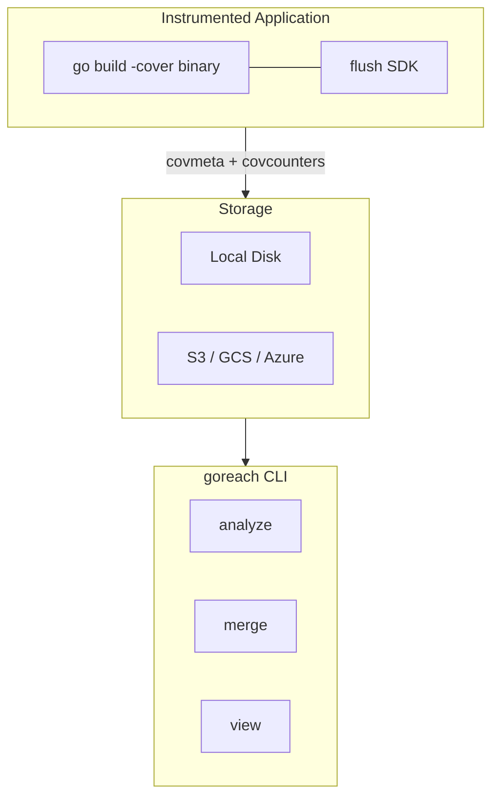

# goreach

[](https://pkg.go.dev/github.com/yag13s/goreach)
[](https://goreportcard.com/report/github.com/yag13s/goreach)
[](LICENSE)

**Find unreached code paths in running Go services.**

goreach sits on top of Go's native coverage instrumentation (`go build -cover` / `GOCOVERDIR`) and turns raw coverage data into actionable JSON reports highlighting exactly which functions and code blocks your production traffic never touches.

## Key Features

- **Production coverage analysis** -- Collect coverage from long-running services without stopping them
- **Flush SDK** -- Lightweight, zero-dependency library to emit coverage data on a schedule, via HTTP, signal, or manual trigger
- **Multi-build merge** -- Automatically reconcile coverage across different binary versions
- **Web UI** -- Interactive browser-based viewer with inline source preview
- **Cloud-agnostic storage** -- Local disk, S3, GCS, Azure, or any custom backend via a simple interface

## Install

```bash
go install github.com/yag13s/goreach/cmd/goreach@latest
```

## Quick Start

```bash
# Build with coverage
go build -cover -covermode=set -o myserver ./cmd/myserver

# Run with GOCOVERDIR
mkdir -p /tmp/coverage
GOCOVERDIR=/tmp/coverage ./myserver

# Stop the process, then analyze
goreach analyze -coverdir /tmp/coverage -pretty
```

<details>
<summary>View the report in browser</summary>

```bash
goreach view -src . report.json
```

</details>

<details>
<summary><strong>Try without building</strong> — pre-generated sample reports</summary>

The repository includes sample reports so you can explore the viewer and merge
workflow immediately:

```bash
# View a single-build report
goreach view testdata/sample-reports/v1.json

# Merge two build versions and view
goreach merge -pretty -o testdata/sample-reports/merged.json \
    testdata/sample-reports/v1.json \
    testdata/sample-reports/v2.json
goreach view -src . testdata/sample-reports/merged.json
```

To generate fresh coverage data from the sample server:

```bash
bash testdata/sampleserver/run.sh
```

</details>

## CLI Commands

| Command | Description |
|---------|-------------|
| `goreach analyze` | Analyze coverage data and output unreached code as JSON |
| `goreach merge` | Merge multiple reports, taking max coverage per function |
| `goreach view` | Launch interactive Web UI with optional source preview |
| `goreach summary` | Print a text coverage summary |
| `goreach version` | Show version info |

<details>
<summary><strong>analyze</strong> flags</summary>

| Flag | Description | Default |
|------|-------------|---------|
| `-profile <file>` | Text coverage profile path | -- |
| `-coverdir <dir>` | GOCOVERDIR path (exclusive with `-profile`) | -- |
| `-r` | Recursively search coverdir | `false` |
| `-pkg <prefixes>` | Package filter (comma-separated) | all |
| `-threshold <float>` | Show functions with coverage <= X% | `100` |
| `-min-statements <n>` | Show functions with >= N unreached statements | `0` |
| `-o <file>` | Output file | stdout |
| `-pretty` | Pretty-print JSON | `false` |

</details>

<details>
<summary><strong>merge</strong> flags</summary>

| Flag | Description | Default |
|------|-------------|---------|
| `-o <file>` | Output file | stdout |
| `-pretty` | Pretty-print JSON | `false` |

Uses the newest report as the structural base. Takes the maximum `coverage_percent` per function across all inputs. Deleted functions (only in older reports) are excluded.

When an older build wins on coverage but lacks unreached block detail (e.g. covdata func origin), the latest build's blocks are preserved in `latest_unreached_blocks`. The viewer shows a toggle to switch between merged and latest-build block views.

</details>

<details>
<summary><strong>view</strong> flags</summary>

| Flag | Description | Default |
|------|-------------|---------|
| `-src <dir>` | Source root for inline code preview | -- (disabled) |
| `-port <n>` | HTTP port | `0` (random) |
| `-no-open` | Don't auto-open browser | `false` |

</details>

## Multi-Build Workflow

When deploying new versions of your service, each build produces different coverage metadata.
goreach handles this by analyzing each build version separately, then merging the results.

<details>
<summary><strong>Per-build analyze → merge</strong></summary>

Analyze each build version in its own directory, then merge. Merging takes the maximum
`coverage_percent` per function across all inputs, so no coverage is lost when you redeploy.

```bash
# Directory structure after collecting coverage from multiple deploys:
# coverage-data/
# ├── abc1234/          ← build version (git short hash)
# │   └── pod-name/
# │       ├── covmeta.*
# │       └── covcounters.*
# └── def5678/
#     └── pod-name/
#         ├── covmeta.*
#         └── covcounters.*

# 1. Analyze each build version separately
for dir in coverage-data/*/; do
    version=$(basename "$dir")
    goreach analyze -coverdir "$dir" -r -pretty -o "reports/$version.json"
done

# 2. Merge all per-version reports
goreach merge -pretty -o merged-report.json reports/*.json

# 3. View in browser (with source preview)
goreach view -src . merged-report.json
```

Makefile example:

```makefile
analyze-coverage:
	@mkdir -p coverage-reports
	@for dir in coverage-data/*/; do \
		version=$$(basename "$$dir"); \
		goreach analyze -coverdir "$$dir" -r -pretty \
			-o "coverage-reports/$$version.json"; \
	done

merge-coverage:
	goreach merge -pretty -o coverage-report.json coverage-reports/*.json

coverage: download-coverage analyze-coverage merge-coverage
```

</details>

<details>
<summary><strong>JSON output vs Web UI</strong></summary>

| Use case | Command | Features |
|----------|---------|----------|
| CI / scripts | `analyze -o report.json` | Filter with jq, diffable, store in Git |
| Human review | `view report.json -src .` | Inline source preview, package tree, block detail |
| Text overview | `summary -coverdir ...` | Terminal-friendly function list with coverage % |

JSON report structure (shortened):

```json
{
  "version": 1,
  "generated_at": "2025-02-28T...",
  "mode": "atomic",
  "total": {
    "total_statements": 120,
    "covered_statements": 95,
    "coverage_percent": 79.16
  },
  "packages": [{
    "import_path": "myapp/handler",
    "files": [{
      "file_name": "myapp/handler/handler.go",
      "functions": [{
        "name": "HandleRequest",
        "line": 28,
        "total_statements": 12,
        "covered_statements": 9,
        "coverage_percent": 75.0,
        "unreached_blocks": [
          {"start_line": 42, "end_line": 45, "num_statements": 2}
        ]
      }]
    }]
  }]
}
```

</details>

## Flush SDK

A zero-dependency library for collecting coverage from running processes. Embed it in your service to flush coverage data without waiting for process exit.

```go
import "github.com/yag13s/goreach/flush"

flush.Enable(flush.Config{
    Storage:      flush.LocalStorage{Dir: "/var/coverage"},
    ServiceName:  "myserver",
    BuildVersion: version,
    Interval:     5 * time.Minute,
    Clear:        true,
})
defer flush.Stop()
```

> **Note:** When using the flush SDK, build with `-covermode=atomic`. The `set` mode is not supported for runtime counter reads.

Safe to call on binaries built without `-cover` -- all flush operations become no-ops.

### Flush Triggers

| Trigger | Use Case | How |
|---------|----------|-----|
| Periodic | Long-running servers | `Config{Interval: 5 * time.Minute}` |
| Manual | Lambda, request-scoped | `flush.Emit()` |
| HTTP | CronJob, external trigger | `flushhttp.Handler()` |
| Signal | Batch jobs, non-HTTP processes | `flush.HandleSignal(syscall.SIGUSR1)` |
| Shutdown | All processes | `defer flush.Stop()` |

### Storage Interface

```go
type Storage interface {
    Store(ctx context.Context, files []string, meta Metadata) error
}
```

Built-in: `LocalStorage`, `WriterStorage`, `objstore.Storage` (S3/GCS/Azure).

<details>
<summary>S3 example</summary>

```go
import "github.com/yag13s/goreach/flush/objstore"

storage := &objstore.Storage{
    Upload: func(ctx context.Context, key string, body io.Reader) error {
        _, err := s3Client.PutObject(ctx, &s3.PutObjectInput{
            Bucket: &bucket, Key: &key, Body: body,
        })
        return err
    },
}
```

Default key format: `<prefix>/<service>/<version>/<pod>/<filename>`

</details>

### HTTP Endpoints (opt-in)

```go
import "github.com/yag13s/goreach/flush/flushhttp"

mux.Handle("/internal/coverage/", flushhttp.Handler())
```

| Method | Path | Action |
|--------|------|--------|
| `GET` | `/internal/coverage` | Return current coverage data |
| `POST` | `/internal/coverage/flush` | Flush to storage |
| `POST` | `/internal/coverage/clear` | Reset counters |

## Architecture



## Deployment Examples

<details>
<summary><strong>Kubernetes + S3</strong></summary>

```go
flush.Enable(flush.Config{
    Storage: &objstore.Storage{
        Upload: func(ctx context.Context, key string, body io.Reader) error {
            _, err := s3Client.PutObject(ctx, &s3.PutObjectInput{
                Bucket: &bucket, Key: &key, Body: body,
            })
            return err
        },
    },
    ServiceName:  "myserver",
    BuildVersion: version,
    Interval:     10 * time.Minute,
})
defer flush.Stop()
```

```bash
# Download and analyze
aws s3 sync s3://bucket/goreach/myserver/ /tmp/coverage/
goreach analyze -coverdir /tmp/coverage -r -pretty
```

</details>

<details>
<summary><strong>AWS Lambda</strong></summary>

Lambda environments freeze between invocations, so timer-based flush does not work.
Call `flush.Emit()` at the end of each request instead.

```go
// init — runs once per cold start
func init() {
    flush.Enable(flush.Config{
        Storage:      storage,  // e.g. objstore.Storage with S3
        ServiceName:  "my-lambda",
        BuildVersion: os.Getenv("BUILD_VERSION"),
        Clear:        true,
    })
}

// handler — flush per invocation
func handler(ctx context.Context, req events.APIGatewayV2HTTPRequest) (events.APIGatewayV2HTTPResponse, error) {
    resp, err := process(ctx, req)
    flush.Emit()  // must be explicit, timers are frozen
    return resp, err
}
```

**Build script** — a shell wrapper creates `GOCOVERDIR` before the Go binary starts
and embeds `BUILD_VERSION` so coverage data is organized by deploy:

```bash
VERSION=$(git rev-parse --short HEAD)
GOOS=linux GOARCH=arm64 go build -cover -covermode=atomic -o bootstrap.bin .
printf '#!/bin/sh\nmkdir -p /tmp/coverage-data\nexport BUILD_VERSION=%s\nexec /var/task/bootstrap.bin "$@"\n' "$VERSION" > bootstrap
chmod +x bootstrap
```

**Collect and analyze:**

```bash
# Download from S3
aws s3 sync s3://my-bucket/goreach/my-lambda/ coverage-data/

# Analyze per build version, then merge
for dir in coverage-data/*/; do
    version=$(basename "$dir")
    goreach analyze -coverdir "$dir" -r -pretty -o "reports/$version.json"
done
goreach merge -pretty -o report.json reports/*.json

# View
goreach view -src . report.json
```

</details>

<details>
<summary><strong>CronJob-triggered flush</strong></summary>

```yaml
apiVersion: batch/v1
kind: CronJob
spec:
  schedule: "0 */6 * * *"
  jobTemplate:
    spec:
      containers:
      - name: coverage-trigger
        command: ["curl", "-X", "POST", "http://myserver:8080/internal/coverage/flush"]
```

</details>

## Requirements

- Go 1.26+
- `go tool covdata` (included with Go)

## License

[MIT](LICENSE)
